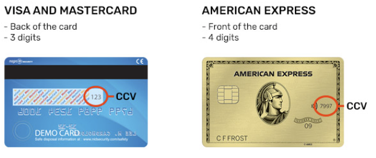

# 题目描述

CCV

```
I've got some credit cards but I don't which ones are valid. Where did I get them? Uh, that's not important.
Oh, you'll probably need this: dae55498c432545826fb153885bcb06b
By mzone (@mzone on discord)

nc puffer.utctf.live 8625

young@ubuntu:~ $  nc puffer.utctf.live 8625
I'll provide you a PAN, date as MMYY, CSC, and a CVV.
You just need to reply with 1 if its valid and 0 if it's invalid.
I'm counting on you. And be sure to keep track of your answers so we don't need to check these again.

PAN: 999554623155882931, date: 0873, code: 473, cvv: 900
Valid?
1
Good job.
PAN: 707283974428771, date: 1027, code: 617, cvv: 253
Valid?
1
You're a big help.
PAN: 92893664848022323, date: 0179, code: 683, cvv: 712
Valid?
1
Nice work!
PAN: 578657095474557841, date: 0239, code: 926, cvv: 363
Valid?
1
Are you just guessing?

```


# 信用卡知识

## 安全码（CSC）

参考：[维基百科-银行卡安全码](https://zh.m.wikipedia.org/wiki/%E9%93%B6%E8%A1%8C%E5%8D%A1%E5%AE%89%E5%85%A8%E7%A0%81)

不同的发卡组织的信用卡安全码的名称和印刷位置不同：

- “CSC”（Card Security Code，银行卡安全代码）：美国运通卡（American Express），为3位数字，印于借记卡背面。
- “CID”（Card ID，银行卡识别码）：发现卡（Discover）、美国运通卡（American Express），为4位数字，印于银行卡正面。美国运通卡通常使用银行卡正面的4位数字，称为银行卡识别码（CID），但在银行卡背面也有一个3位数的代码，称为银行卡安全码（CSC）。
- “CVC”(Card Validation Code，银行卡验证码)：万事达卡（Mastercard），为3位数字，平印于银行卡背面。
- “CVV”(Card Verification Value，银行卡验证值)：Visa卡（Visa），为3位数字，平印于银行卡背面。
- “CAV”(Card Authentication Value，银行卡验证值)：JCB卡（JCB），为3位数字，平印于银行卡背面。
- “CVD”(Card Verification Data，银行卡验证数据)：发现卡（Discover），为3位数字，平印于银行卡背面。
- “CVN”(Card Validation Number，银行卡验证数字)：中国银联卡（China UnionPay），为3位数字，平印于银行卡背面。

## 发卡行识别码（PAN)

参考：[维基百科-发卡行识别码](https://zh.wikipedia.org/wiki/%E5%8F%91%E5%8D%A1%E8%A1%8C%E8%AF%86%E5%88%AB%E7%A0%81)

PAN (Payment Card Number，发卡行识别码), 




# 参考

1. 
2. 