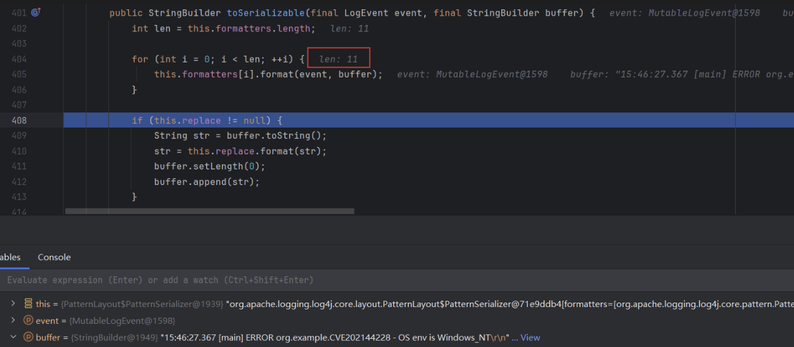
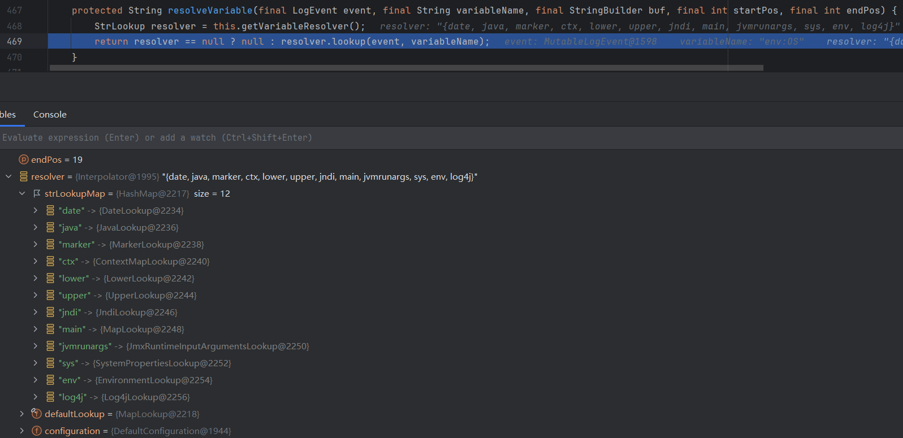
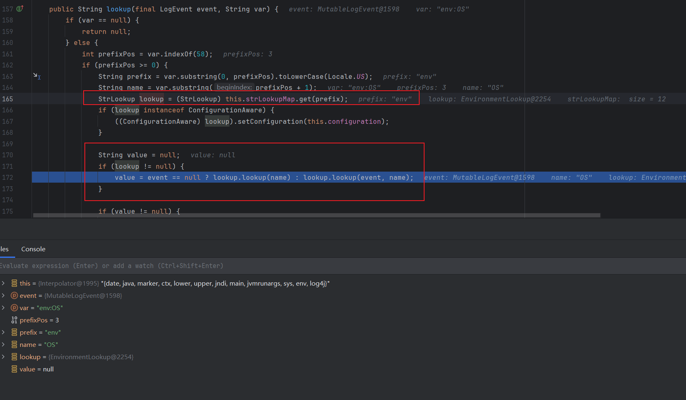

# 概述

Apache log4j 存在 [Apache Lookups](https://logging.apache.org/log4j/2.x/manual/lookups.html) 注入（CVE-2021-44228）


    Lookups provide a way to add values to the Log4j configuration at arbitrary places. They are a particular type of Plugin that implements the StrLookup interface. Information on how to use Lookups in configuration files can be found in the Property Substitution section of the Configuration page.

[Apache Lookups](https://logging.apache.org/log4j/2.x/manual/lookups.html) 提供了一种灵活的配置方式，可以在日志的任意位置插入配置值。该功能可以在配置文件指定 `${key: value}` 执行内置 lookups 功能，详细配置参考 [Configuration](https://logging.apache.org/log4j/2.x/manual/configuration.html)

[CVE-2021-44228](https://nvd.nist.gov/vuln/detail/CVE-2021-44228) 漏洞点是 log4j 打印的日志参数可以注入 lookups ，POC 如下，从打印的参数注入 env 和 date 这两个 lookups ,打印的位置实际打印了环境变量和日期


```java
package org.example;
import org.apache.logging.log4j.LogManager;
import org.apache.logging.log4j.Logger;

public class CVE202144228
{
    public static final Logger logger = LogManager.getLogger(CVE202144228.class);
    public static void main( String[] args )
    {
        String env = "${env:OS}";
        String date = "${date: MM-dd-yyyy}";
        logger.error("OS env is {}", env);
        logger.error("date is {}", date);
    }
}

```
程序运行输出
```
11:46:43.111 [main] ERROR org.example.CVE202144228 - OS env is Windows_NT
11:46:43.112 [main] ERROR org.example.CVE202144228 - date is  08-10-2024
```

# 漏洞根因分析

逐步调试，打印的日志由 toSerializable 构造，返回的 buffer 就是要打印的日志

```java
// \org\apache\logging\log4j\core\layout\PatternLayout.class

public StringBuilder toSerializable(final LogEvent event, final StringBuilderbuffer buffer) {
    int len = this.formatters.length;
    for(int i = 0; i < len; ++i) {
        this.formatters[i].format(event, buffer);
    }
    if (this.replace != null) {
        String str = buffer.toString();
        str = this.replace.format(str);
        buffer.setLength(0);
        buffer.append(str);
    }
    return buffer;
}
```


以 `logger.error("OS env is {}", env);` 为例，一共调用了 11 个 formater。① - ⑥ 加上 5 个箭头的空格，一共 11 个 format。




上述 format 的调用栈如下

```java

// \org\apache\logging\log4j\core\pattern\PatternFormatter.class

public void format(final LogEvent event, final StringBuilder buf) {
    if (this.skipFormattingInfo) {
        this.converter.format(event, buf);
    } else {
        this.formatWithInfo(event, buf);
    }
}

--------------------

// \org\apache\logging\log4j\core\pattern\MessagePatternConverter.class

public void format(final LogEvent event, final StringBuilder toAppendTo) {
    Message msg = event.getMessage();
    if (msg instanceof StringBuilderFormattable) {
        boolean doRender = this.textRenderer != null;
        StringBuilder workingBuilder = doRender ? new StringBuilder(80) : toAppendTo;
        int offset = workingBuilder.length();
        if (msg instanceof MultiFormatStringBuilderFormattable) {
            ((MultiFormatStringBuilderFormattable)msg).formatTo(this.formats, workingBuilder);
        } else {
            ((StringBuilderFormattable)msg).formatTo(workingBuilder);
        }
        if (this.config != null && !this.noLookups) {
            for(int i = offset; i < workingBuilder.length() - 1; ++i) {
                if (workingBuilder.charAt(i) == '$' && workingBuilder.charAt(i + 1) == '{') {
                    String value = workingBuilder.substring(offset, workingBuilder.length());
                    workingBuilder.setLength(offset);
                    workingBuilder.append(this.config.getStrSubstitutor().replace(event, value));  // <-- 进一步调用
                }
            }
        }
        if (doRender) {
            this.textRenderer.render(workingBuilder, toAppendTo);
        }
    } else {
        if (msg != null) {
            String result;
            if (msg instanceof MultiformatMessage) {
                result = ((MultiformatMessage)msg).getFormattedMessage(this.formats);
            } else {
                result = msg.getFormattedMessage();
            }
            if (result != null) {
                toAppendTo.append(this.config != null && result.contains("${") ? this.config.getStrSubstitutor().replace(event, result) : result);
            } else {
                toAppendTo.append("null");
            }
        }
    }
}

```





根据 prefix 获取对应的 lookup 



# 漏洞利用

## 

# 相关连接

1. [NVD - CVE-2021-44228 Detail](https://nvd.nist.gov/vuln/detail/CVE-2021-44228)
2. [log4j Security](https://logging.apache.org/log4j/2.x/security.html)


