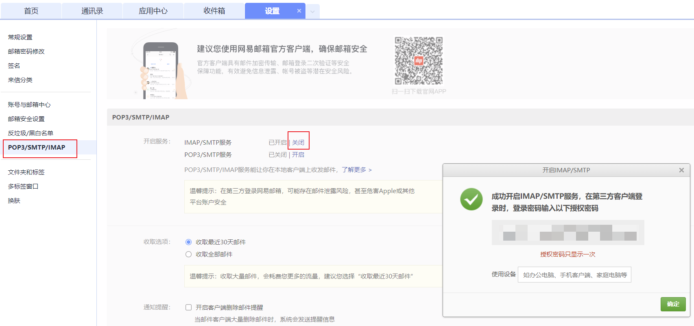

# SMTP协议与邮件格式

[SMTP 协议](https://datatracker.ietf.org/doc/html/rfc5321)

 The SMTP design can be pictured as:

```

                  +----------+                +----------+
      +------+    |          |                |          |
      | User |<-->|          |      SMTP      |          |
      +------+    |  Client- |Commands/Replies| Server-  |
      +------+    |   SMTP   |<-------------->|    SMTP  |    +------+
      | File |<-->|          |    and Mail    |          |<-->| File |
      |System|    |          |                |          |    |System|
      +------+    +----------+                +----------+    +------+
                   SMTP client                SMTP server
```


# 交互

使用 `openssl s_client -connect smtp.163.com:465` 命令连接 163 SMTP 服务器进行交互式操作。如果需要登录 163 的SMTP ，需要开启 SMTP 服务并获取授权密码，操作如下图所示



```
helo example.com
auth login
YWxpY2VAMT*****YzLmNvbQo=
cGFzc3dv*****cmQK                   # 这里填写 base64 之后的授权码 
mail from: <alice@163.com>
rcpt to: <bob@163.com>
data
to: bob@163.com
from: alice@163.com
subject: test mail

this is a test mail from cli

.

```

SMTP 交互命令需要遵从协议指定的顺序 [smtp rfc5321: 4.1.4. Order of Commands](https://datatracker.ietf.org/doc/html/rfc5321#section-4.1.4)

- 首先发送 EHLO（或者 HELO），表示开始一个初始化或开始一个新的邮件事务（本人理解发送一封邮件算一个事务），EHLO/HELO 携带客户端 FQDN （域名）发送给服务端作为客户都标识，也可以携带任意[地址字符](https://datatracker.ietf.org/doc/html/rfc5321#section-4.1.3)

Command（不区分大小写）| form | example | 描述|备注 
:-|:-|:-|:-|:-
EHLO/HELO| EHLO \<Domain\>\<CRLF\> | EHLO youngseaz.com| A session that will contain mail transactions MUST first beinitialized by the use of the EHLO command. These commands are used to identify the SMTP client to the SMTP server.  The argument clause contains the fully-qualified domain name of the SMTP client[^1] |The SMTP command EHLO, superseding the earlier HELO|
AUTH| AUTH [LOGIN\|PLAIN\|CRAM-MD5]| AUTH LOGIN | 支持 LOGIN、PLAIN 及 CRAM-MD5 三种认证方式

[^1]: https://datatracker.ietf.org/doc/html/rfc5321#section-4.1.1.1


# 邮件伪造


