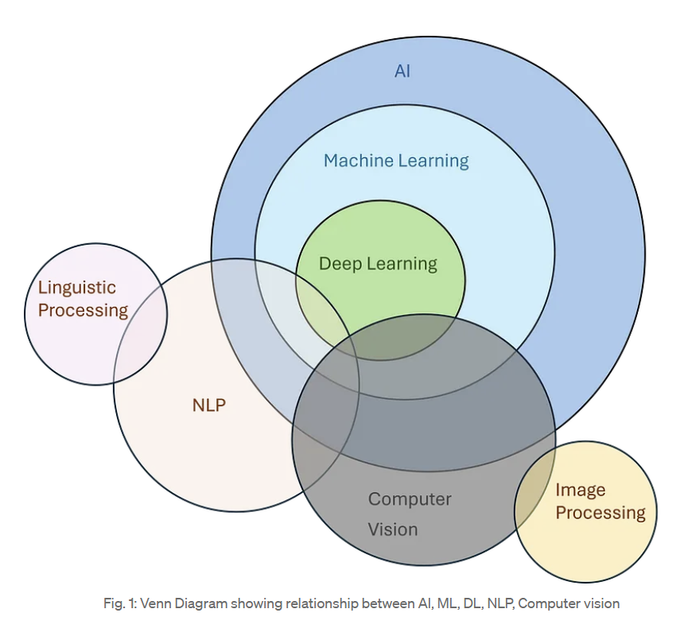

1. 人工智能基础
1.1 人工智能概述
1.2 AI的历史与发展
1.3 AI的应用领域
1.4 人工智能的基本概念和定义
1.5 人工智能的分类（狭义AI vs. 通用AI）

2. 机器学习
2.1 机器学习概述
2.2 监督学习
- 线性回归
- 逻辑回归
- 支持向量机（SVM）
- 决策树与随机森林
- K近邻算法（KNN）
- 神经网络基础
2.3 无监督学习
- 聚类算法（K均值，DBSCAN等）
- 降维方法（PCA, t-SNE等）
- 异常检测
2.4 强化学习
- 马尔可夫决策过程（MDP）
- Q学习与深度Q网络（DQN）
- 策略梯度方法（REINFORCE，PPO等）
2.5 深度学习
- 神经网络基础
- 前馈神经网络（Feedforward Neural Networks, FNN）
- 卷积神经网络（CNN）
- 循环神经网络（RNN）
- 长短期记忆（LSTM）
- 自注意力机制与Transformer
- 生成对抗网络（GAN）

3. 自然语言处理（NLP）
3.1 NLP基础概念
3.2 文本预处理与词向量（词袋模型，TF-IDF，Word2Vec，GloVe）
3.3 语言模型与文本生成
3.4 机器翻译
3.5 情感分析
3.6 命名实体识别（NER）
3.7 问答系统
3.8 深度学习在NLP中的应用（BERT，GPT，T5等）

4. 计算机视觉
4.1 计算机视觉概述
4.2 图像预处理与特征提取
4.3 目标检测与分割
- YOLO（You Only Look Once）
- Faster R-CNN
- Mask R-CNN
4.4 图像分类与识别
4.5 视觉对象追踪
4.6 人脸识别
4.7 生成模型与图像生成（例如GAN）

5. 语音处理与识别
5.1 语音信号处理
5.2 语音识别
5.3 语音合成（TTS）
5.4 声音情感分析
5.5 对话系统与语音交互

6. 机器人学
6.1 机器人学概述
6.2 机器人定位与导航
6.3 机器人感知与控制
6.4 多机器人系统与协作
6.5 机器人与深度学习的结合

7. 知识表示与推理
7.1 知识表示方法
- 逻辑与规则
- 语义网与本体论
- 生产系统与框架系统
7.2 规划与决策
- 自动规划方法
- 搜索算法（如A*算法，蒙特卡洛树搜索）
7.3 归纳与演绎推理
7.4 模糊逻辑与模糊推理

8. AI的伦理与社会影响
8.1 人工智能的伦理问题
8.2 AI与隐私保护
8.3 AI的透明度与可解释性
8.4 AI在工作与就业中的影响
8.5 人工智能的监管与法律问题

9. AI技术的应用
9.1 AI在医疗领域的应用
9.2 AI在金融领域的应用
9.3 AI在教育领域的应用
9.4 AI在自动驾驶与交通管理中的应用
9.5 AI在制造业中的应用
9.6 AI在智能家居与物联网中的应用

10. 前沿技术与未来趋势
10.1 量子计算与人工智能的结合
10.2 自适应AI与自学习系统
10.3 人工智能的未来发展方向与挑战
10.4 AI与人类智能的关系（通用AI，意识问题等）

11. 大模型（Large Models）
11.1 大模型概述

大模型的定义
为什么大模型在现代AI中变得如此重要
大模型与传统模型的区别
11.2 大模型的架构与设计

神经网络的规模化
分布式训练与并行化技术
模型并行与数据并行
模型压缩与高效推理（如蒸馏、量化、剪枝等）
11.3 预训练与微调

预训练语言模型（如GPT、BERT等）的概念
微调方法与技巧
迁移学习与多任务学习
11.4 Transformer架构与自注意力机制

Transformer的基本概念与原理
自注意力机制（Self-Attention）
Transformer中的位置编码与多头注意力
位置编码与顺序建模
长期依赖问题的解决
11.5 常见的大模型及其应用

GPT系列（Generative Pre-trained Transformer）
GPT-3、GPT-4等模型的原理与应用
生成式预训练与推理能力
BERT（Bidirectional Encoder Representations from Transformers）
双向编码器与上下文建模
在NLP任务中的应用（如问答、文本分类等）
T5（Text-to-Text Transfer Transformer）
将所有任务转化为文本到文本的框架
多任务学习与大规模迁移学习
DALL·E与CLIP
图像生成模型DALL·E的原理与应用
CLIP模型：文本与图像的联合学习
大规模视觉模型
Vision Transformers（ViT）与卷积神经网络的比较
GPT-4在多模态上的拓展应用（如图像和文本联合理解）
11.6 大模型的计算资源与训练挑战

训练大模型所需的硬件资源（如TPU、GPU等）
分布式计算与高效训练框架（如DeepSpeed、Horovod等）
分布式存储与数据并行技术
大模型的训练时间与成本挑战
训练数据集的规模与质量
11.7 大模型的优化与高效推理

模型蒸馏（Distillation）：将大模型压缩为小模型
模型量化与剪枝
推理优化（TensorRT、ONNX等）
推理加速硬件（如Edge AI芯片，FPGA等）
11.8 大模型的可解释性与安全性

大模型的可解释性问题
深度学习模型的透明度与可理解性
AI的偏见与公平性问题
安全性与对抗性攻击（如对抗样本，模型鲁棒性）
11.9 多模态大模型

图像与文本的联合学习（如CLIP、Florence等）
音频、图像、文本的跨模态学习
复杂任务的多模态理解（如视觉问答、视频理解）
11.10 大模型的伦理与社会影响

大模型的能耗与环境影响
隐私问题与数据合规性（如GDPR）
AI生成内容的真实性与滥用（如Deepfake技术）
AI模型的公平性、透明度与监管
12. 未来的趋势与大模型的挑战
12.1 超大规模模型的未来

规模极限：模型的大小与性能提升之间的平衡
可持续AI：减少训练成本与能耗
模型无关的通用AI
12.2 自监督学习与大模型的结合

自监督学习的定义与应用
如何使用自监督学习提高大模型的效率与效果
12.3 多领域联合学习与跨领域应用

跨领域知识迁移与联合学习
大模型在跨行业中的应用（医疗、金融、法务等）