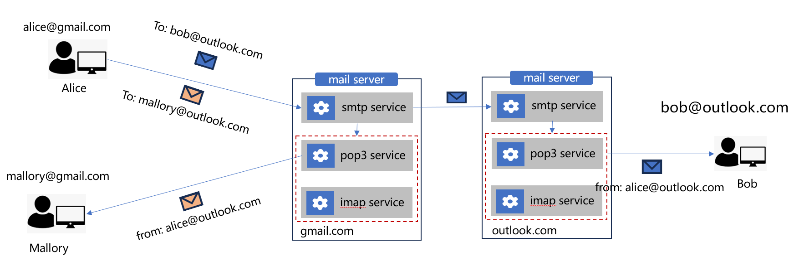

# 邮件服务系统

服务|描述
:-|:-
SMTP 服务 | SMTP 服务负责邮件发送，当发件人和收件处于同一域时（如 Alice 和 Mallory），SMTP 将邮件转给本地的 POP3 或者 IAMP 服务；发件人和收件人处于不同域时（如 Alice 和 Bob），SMTP 将邮件发送给收件域的 SMTP 服务，其再发送给 POP3 或者 IAMP 服务。
POP3 服务 | POP3 服务负责邮件接收，客户端从 POP3 服务端下载邮件到本地，在本地进行操作（如 标记重要邮件，标记未读，移动等），下载之后服务端的邮件会被删除掉。缺点：多个客户端场景，第一个客户端 check 邮件之后，其他客户端就不能再从服务端下载邮件，也看不到服务端的邮件。
IAMP 服务 | 与 POP3 一样，都是负责邮件接收，不同的是，客户端读取到邮件之后，邮件任然会保存在服务端，对邮件的操作（如 标记重要邮件，标记未读，移动、分类等）也会同步到服务端，多个客户端直接的邮件状态时同步的。 

# 邮件服务安装

开源邮件服务

`sudo apt install postfix sasl2-bin` 

